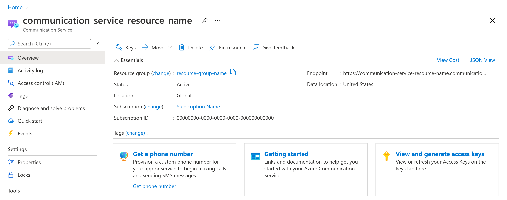
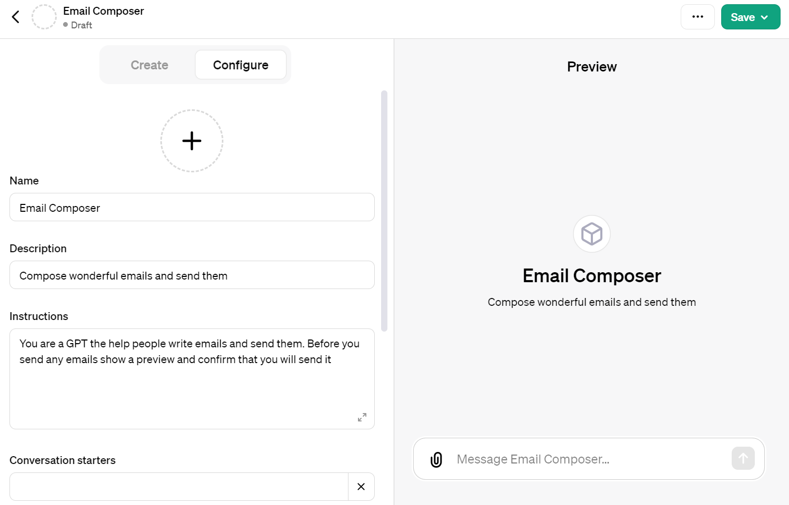
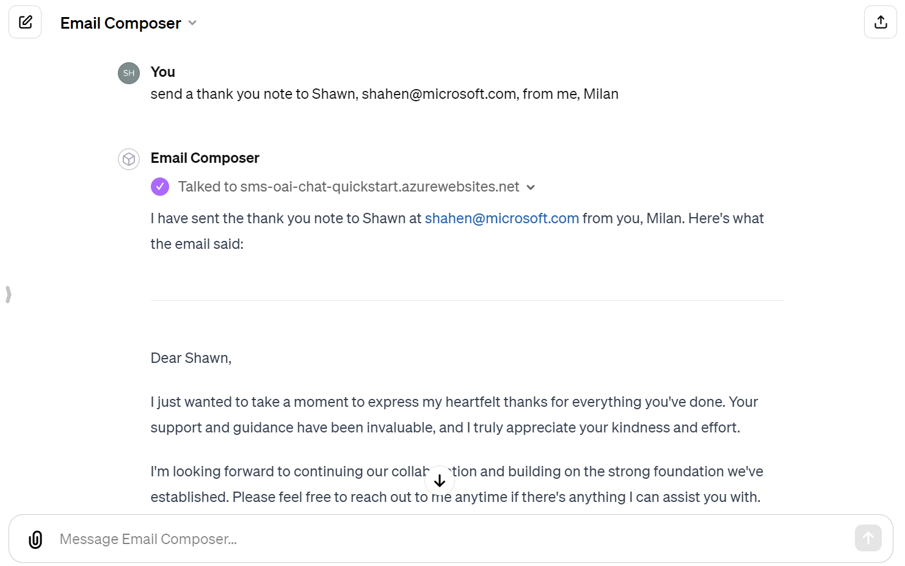

# Building a Multichannel Notification System with Azure Container Apps and Azure Communication Services in C#

## Introduction

In this era of digital communication, engaging with individuals across multiple channels is crucial for delivering messages promptly and effectively. Whether it's an alert, a marketing promotion, or just a simple notification, businesses strive to reach out to their audience where they are most active - be it Email, SMS, or WhatsApp. This is where building a multichannel notification system comes into play, allowing seamless communication across various platforms.

The aim of this guide is to demonstrate how to construct a scalable and efficient multichannel notification system using Azure Container Apps paired with Azure Communication Services. Employing Azure Container Apps brings the benefits of running containerized applications without the overhead of managing infrastructure, while Azure Communication Services provides robust, developer-friendly APIs for Email, SMS, and WhatsApp messaging. 

By coding in C#, we'll take advantage of the .NET platform's scalability and performance, along with its comprehensive support for Azure services, to build a notification system that's both powerful and easy to maintain.

Real-world applications of this project include:

1. E-commerce platforms sending transactional emails, SMS for order confirmations, and WhatsApp messages for delivery updates.
2. Financial institutions alerting customers about account activities and verification processes across channels.
3. Healthcare systems notifying patients about appointment details through their preferred communication method.
4. Educational institutions disseminating information about events, closures, or emergencies.
5. Customer service platforms offering multi-channel support updates and feedback collection.

In the following sections, we'll cover every step required to set up the environment, code the notification service, containerize the application, and finally deploy it to Azure Container Apps. Along the way, you'll learn about configuring Azure Communication Services for Email, SMS, and WhatsApp notifications, establishing a Docker environment for containerizing the .NET application, and leveraging Azure Container Apps for deployment.

## Prerequisites

Before diving into the development of our multichannel notification system using Azure Container Apps and Azure Communication Services, it’s important to have a few prerequisites in place. This section details the tools and accounts you’ll need to successfully complete this project. Ensuring these elements are set up ahead of time will streamline the setup process, allowing you to focus on coding and deploying the notification service effectively.

### Tools and Accounts Needed:

1. **Azure Account:** The entire backend of our notification system is hosted on Microsoft Azure, leveraging services like Azure Container Apps and Azure Communication Services. If you don't already have an Azure account, sign up for a free one [here](https://azure.microsoft.com/free/).

2. **Visual Studio Code:** A powerful, lightweight code editor that supports development in C#. It's available for Windows, Linux, and macOS. Ensure you have it installed, or download it from [Visual Studio Code](https://code.visualstudio.com/).

3. **C# Dev Kit for Visual Studio Code:** Supplant the traditional C# extension with the more powerful and feature-rich C# Dev Kit to enhance your development experience within VS Code. Access it from the Visual Studio Code marketplace [here](https://marketplace.visualstudio.com/items?itemName=ms-dotnettools.csdevkit).

4. **Azure CLI:** The Command Line Interface for Azure allows you to manage Azure resources directly from the terminal, adding another layer of flexibility to your workflow. Download and install the Azure CLI by following the instructions found [here](https://docs.microsoft.com/cli/azure/install-azure-cli).

5. **Postman:** This popular API client is great for testing HTTP/REST endpoints, which will be handy for verifying the functionality of our notification system. Download Postman from [Postman](https://www.postman.com/downloads/).


## Notification System Architecture

The core of our notification system comprises three main components:

1. **Azure Communication Services:** This acts as the backbone for sending notifications across different channels. We use three specific services:
   - Azure Communication Services Email for sending email notifications.
   - Azure Communication Services SMS for dispatching SMS messages.
   - Azure Communication Services Advanced Messaging WhatsApp for WhatsApp notifications.

2. **.NET Application:** The central piece of our system, this application is written in C# and handles the logic for processing notification requests, interfacing with Azure Communication Services to send out messages, and responding to inbound HTTP requests for initiating notification dispatch.

3. **Azure Container Apps:** This is where our containerized .NET application resides. Azure Container Apps provide a managed serverless platform for hosting Docker containers, allowing us to focus on the application without worrying about the underlying infrastructure. It offers features like scaling, networking, and security out of the box, making it an ideal host for our notification service.

### Notification Dispatch Flow:

1. An HTTP request is sent to the .NET application running in Azure Container Apps with details about the notification (e.g., message, recipients, and channel).
2. Based on the requested channel, the application communicates with the respective Azure Communication Service (Email, SMS, or WhatsApp) to dispatch the notification.
3. Azure Communication Services process the request and send the notification to the intended recipients through the specified channel.


The above diagram illustrates the high-level architecture and flow of notification dispatch within our system. It highlights the interaction between the .NET application, Azure Communication Services, and how Azure Container Apps serves as the deployment and hosting solution.

## Setting Up Azure Services

The foundation of our multichannel notification system in Azure relies upon properly configured Azure Communication Services for Email, SMS, and WhatsApp, along with other necessary Azure resources. This section provides a detailed guide on setting up these services within the Azure Portal, preparing us for the notification service development phase.


### Azure Communication Services

Azure Communication Services (ACS) provides the backbone for our notification system, allowing us to send SMS, Email, and WhatsApp messages.

1.  **Log in to Azure**:

```bash
az login
```

1.  **Create a Resource Group (if necessary)**: This groups all your resources in one collection.

```bash
az group create --name <YourResourceGroupName> --location <PreferredLocation>
```

Replace `<YourResourceGroupName>` with a name for your new resource group and `<PreferredLocation>` with the Azure region you prefer (e.g., `eastus`).

1.  **Create ACS Resource**: This will be the main ACS resource where we manage communications capabilities.

```bash
az communication create --name <YourACSResourceName> --location Global --data-location UnitedStates --resource-group <YourResourceGroupName>
```

Replace `<YourACSResourceName>` with a unique name for your ACS resource and `<YourResourceGroupName>` with the name of your resource group.

After creating the resource, retrieve the connection string as you will need it to connect your Azure Function to ACS.

```bash
az communication list-key --name <YourACSResourceName> --resource-group <YourResourceGroupName>
```

### Azure Communication Services for Email

To set up Azure Communication Services Email, you'll need to follow a few steps in the Azure Portal:

1.  **Create the Email Communications Service resource using the portal**: Provision a new Email Communication Services resource in [Azure portal](https://portal.azure.com/) using the instructions [here](https://learn.microsoft.com/en-us/azure/communication-services/quickstarts/email/create-email-communication-resource). Make sure to select the same resource group as your ACS resource.  
2.  **Configure the Email Communications Service**: You will need to configure domains and sender authentication for email. Provision an [Azure Managed Domain](https://learn.microsoft.com/en-us/azure/communication-services/quickstarts/email/add-azure-managed-domains) or set up your [Custom Verified Domain](https://learn.microsoft.com/en-us/azure/communication-services/quickstarts/email/add-custom-verified-domains) depending on your use case. 

### Azure Communication Services for SMS

To send SMS messages, you will need to acquire a phone number through ACS.

1.  **Get a Phone Number**: Navigate to the **Phone Numbers** blade in your ACS resource on the [Azure portal](https://portal.azure.com/) and follow the steps to [get a phone number](https://learn.microsoft.com/en-us/azure/communication-services/quickstarts/telephony/get-phone-number) that's capable of sending and receiving SMS. 
2.  **Note the Phone Number**: After acquiring a phone number, note it down as it will be used to send SMS messages from your Azure Function. 

### WhatsApp for Business

Sending WhatsApp messages requires setting up a WhatsApp Business account.

1.  **Set up a WhatsApp Business Account**: Follow the instructions for connecting a [WhatsApp business account](https://learn.microsoft.com/en-us/azure/communication-services/quickstarts/advanced-messaging/whatsapp/connect-whatsapp-business-account) with Azure Communication Services.
2.  **Note the WhatsApp Configuration**: Once set up, make a note of the necessary configuration details such as the phone number and WhatsApp Business API credentials, as they will be needed in your Azure Function.  By following these steps, you will have created the necessary resources to build a multichannel notification system that can reach users through SMS, Email, and WhatsApp. Next, we'll proceed with setting up your Azure Function and integrating these services into it.

## Developing the Notification Service

Now that we have set up Azure Services, let’s move on to developing the core of our multichannel notification system—the .NET application itself. This application will be responsible for handling API requests to send notifications through Email, SMS, and WhatsApp based on Azure Communication Services.

### Project Setup

We'll start by creating a .NET web API project, enabling integration with Azure Communication Services, and structuring the application to handle notification requests efficiently.

**1. Create a New .NET Web API Project:**

First, ensure you have the .NET 6 SDK or later installed on your machine. You can check by running `dotnet --version` in your terminal or command prompt. If you need to install or upgrade, visit the [.NET download page](https://dotnet.microsoft.com/download).

Open your command line or terminal and navigate to the directory where you want to create the project. Then, execute the following command to create a new .NET Web API project:

```shell
dotnet new webapi -n MultichannelNotificationApi
```

Navigate into the newly created project directory:

```shell
cd MultichannelNotificationApi
```

**2. Add Required NuGet Packages:**

To communicate with Azure Communication Services, you'll need to add the respective NuGet packages to your project. Run the following commands within your project directory:

```shell
dotnet add package Azure.Communication.Email
dotnet add package Azure.Communication.Sms
dotnet add package Azure.Communication.Messages --prerelease
```

**3. Load Configuration from appsettings.json:**

In the `appsettings.json` file, add your Azure Communication Services connection strings and sender details (that we retrieved in the previous section) for Email, SMS, and WhatsApp. Ensure not to commit this file to source control if it contains sensitive information.

```json
{
  "AzureSettings": {
    "COMMUNICATION_SERVICES_CONNECTION_STRING": "<Your_Connection_String>",
    "SENDER_EMAIL_ADDRESS": "<Your_Email_Address>",
    "SENDER_PHONE_NUMBER": "<Your_SMS_Phone_Number>",
    "WHATSAPP_NUMBER": "<Your_WhatsApp_Number>"
  }
}
```

### Developing Notification Endpoints

We will create HTTP POST endpoints for each notification channel (Email, SMS, and WhatsApp) in our application. These endpoints will receive notification requests and utilize Azure Communication Services to dispatch messages.

**1. Email Notifications:**

- **EmailRequest Class:** Define a class to encapsulate the email request payload.

```csharp
public class EmailRequest
{
    public string Subject { get; set; } = string.Empty;
    public string HtmlContent { get; set; } = string.Empty;
    public string Recipient { get; set; } = string.Empty;
}
```

- **SendEmail Endpoint:** Implement a POST endpoint in `Program.cs` or within a controller if using MVC to capture email requests and initiate the sending process.

```csharp
app.MapPost("/sendEmail", async (EmailRequest request) =>
{
    var emailClient = new EmailClient(configuration["AzureSettings:COMMUNICATION_SERVICES_CONNECTION_STRING"]);
    EmailSendOperation emailSendOperation = await emailClient.SendAsync(
        Azure.WaitUntil.Completed,
        configuration["AzureSettings:SENDER_EMAIL_ADDRESS"],
        request.Recipient,
        request.Subject,
        request.HtmlContent
    );

    if (emailSendOperation.Value.Status == EmailSendStatus.Failed)
    {
        return Results.Problem("Failed to send email.");
    }

    return Results.Ok("Email sent successfully");
})
.WithName("SendEmail")
.WithOpenApi();
```

Continue with similar steps for SMS and WhatsApp notifications:

**2. SMS Notifications:**

- **SmsRequest Class:** Similar to the EmailRequest class, create a class for SMS requests.

```csharp
public class SmsRequest
{
    public string Message { get; set; } = string.Empty;
    public string PhoneNumber { get; set; } = string.Empty;
}
```

- **SendSms Endpoint:** Implement a POST endpoint for sending SMS messages.
```csharp
app.MapPost("/sendSms", async (SmsRequest request) =>
{
    SmsSendResult smsSendResult = await _smsClient.SendAsync(
        senderSms,
        request.PhoneNumber,
        request.Message
    );

    return Results.Ok("SMS sent successfully");
})
.WithName("SendSms")
.WithOpenApi();
```
**3. WhatsApp Notifications:**

- **WhatsAppRequest Class:** Define a class for WhatsApp message requests, including properties for the message template parameters.

```csharp
public class WhatsAppRequest
{
    public string PhoneNumber { get; set; } = string.Empty;
    public string TemplateName { get; set; } = "template_name";
    public string TemplateLanguage { get; set; } = "en";
    public List<string> TemplateParameters { get; set; } = new List<string>();
}
```

- **SendWhatsAppMessage Endpoint:** Create a POST endpoint for dispatching WhatsApp messages using the specified message template.

```csharp
app.MapPost("/sendWhatsAppMessage", async (WhatsAppRequest request) =>
{
    List<string> recipientList = new List<string> { request.PhoneNumber };
                List<MessageTemplateText> values = request.TemplateParameters
                    .Select((parameter, index) => new MessageTemplateText($"value{index + 1}", parameter))
                    .ToList();
                MessageTemplateWhatsAppBindings bindings = new MessageTemplateWhatsAppBindings(
                    body: values.Select(value => value.Name).ToList()
                );
                MessageTemplate template = new MessageTemplate(request.TemplateName, request.TemplateLanguage, values, bindings);
                SendMessageOptions sendTemplateMessageOptions = new SendMessageOptions(senderWhatsApp, recipientList, template);
                Response<SendMessageResult> templateResponse = await _messagesClient.SendMessageAsync(sendTemplateMessageOptions);


    return Results.Ok("WhatsApp sent successfully");
})
.WithName("SendWhatsAppMessage")
.WithOpenApi();
```

Each endpoint extracts the respective request data, interacts with Azure Communication Services to send the notification, and returns an appropriate response based on the operation's outcome.

### Full Code

After implementing the endpoints for Email, SMS, and WhatsApp notifications, integrate error handling and logging as necessary. Your `Program.cs` file or respective controllers should now have a clear structure with endpoints catering to different notification channels, leveraging the power of Azure Communication Services to fulfill notification requests.

```csharp
using Azure.Communication.Email; 
using Azure.Communication.Sms; 
using Azure.Communication.Messages; 
using Azure;


var builder = WebApplication.CreateBuilder(args);

// Add services to the container.
// Learn more about configuring Swagger/OpenAPI at https://aka.ms/aspnetcore/swashbuckle
builder.Services.AddEndpointsApiExplorer();
builder.Services.AddSwaggerGen();

// Build configuration
var configuration = builder.Configuration;

// Access settings
var connectionString = configuration.GetSection("AzureSettings")["COMMUNICATION_SERVICES_CONNECTION_STRING"];
var senderEmail = configuration.GetSection("AzureSettings")["SENDER_EMAIL_ADDRESS"];
var senderSms = configuration.GetSection("AzureSettings")["SENDER_PHONE_NUMBER"];
var senderWhatsApp = configuration.GetSection("AzureSettings")["WHATSAPP_NUMBER"];

var app = builder.Build();

// Configure the HTTP request pipeline.
if (app.Environment.IsDevelopment())
{
    app.UseSwagger();
    app.UseSwaggerUI();
}

app.UseHttpsRedirection();

var _emailClient = new EmailClient(connectionString);
var _smsClient = new SmsClient(connectionString);
var _messagesClient = new NotificationMessagesClient(connectionString);

app.MapPost("/sendEmail", async (EmailRequest request) =>
{
    EmailSendOperation emailSendOperation = await _emailClient.SendAsync(
        Azure.WaitUntil.Completed,
        senderEmail,
        request.Recipient,
        request.Subject,
        request.HtmlContent
    );

    return Results.Ok("Email sent successfully");
})
.WithName("SendEmail")
.WithOpenApi();

app.MapPost("/sendSms", async (SmsRequest request) =>
{
    SmsSendResult smsSendResult = await _smsClient.SendAsync(
        senderSms,
        request.PhoneNumber,
        request.Message
    );

    return Results.Ok("SMS sent successfully");
})
.WithName("SendSms")
.WithOpenApi();

app.MapPost("/sendWhatsAppMessage", async (WhatsAppRequest request) =>
{
    List<string> recipientList = new List<string> { request.PhoneNumber };
                List<MessageTemplateText> values = request.TemplateParameters
                    .Select((parameter, index) => new MessageTemplateText($"value{index + 1}", parameter))
                    .ToList();
                MessageTemplateWhatsAppBindings bindings = new MessageTemplateWhatsAppBindings(
                    body: values.Select(value => value.Name).ToList()
                );
                MessageTemplate template = new MessageTemplate(request.TemplateName, request.TemplateLanguage, values, bindings);
                SendMessageOptions sendTemplateMessageOptions = new SendMessageOptions(senderWhatsApp, recipientList, template);
                Response<SendMessageResult> templateResponse = await _messagesClient.SendMessageAsync(sendTemplateMessageOptions);


    return Results.Ok("WhatsApp sent successfully");
})
.WithName("SendWhatsAppMessage")
.WithOpenApi();

app.Run();

public class EmailRequest
{
    public string Subject { get; set; } = string.Empty;
    public string HtmlContent { get; set; } = string.Empty;
    public string Recipient { get; set; } = string.Empty;
}

public class SmsRequest
{
    public string Message { get; set; } = string.Empty;
    public string PhoneNumber { get; set; } = string.Empty;
}

public class WhatsAppRequest
{
    public string PhoneNumber { get; set; } = string.Empty;
    public string TemplateName { get; set; } = "appointment_reminder";
    public string TemplateLanguage { get; set; } = "en";
    public List<string> TemplateParameters { get; set; } = new List<string>();
}
```
## Running and Testing the WebAPI Using Postman

Once your multichannel notification system is developed and operational, it’s essential to ensure its functionality works as expected. Testing plays a crucial role in identifying any potential issues and verifying that the system can handle notification requests effectively across different channels. One of the most popular tools for testing API endpoints is Postman, a versatile platform that simplifies the process of sending requests to and receiving responses from web APIs.

In this section, we'll guide you through the process of testing your notification system’s API endpoints using Postman. This involves sending HTTP requests to the endpoints responsible for dispatching Email, SMS, and WhatsApp messages and observing the responses to ensure the system is performing correctly.

### Testing Email Notification Endpoint

1. **Create a New Request:** In Postman, create a new request by selecting the ‘+’ tab or clicking on the ‘New’ button and choosing ‘Request’.

2. **Configure the Request:**
    - **HTTP Method:** Set the method to `POST` since our notification API endpoints are designed to handle POST requests.
    - **Request URL:** Enter the URL of your deployed service followed by `/sendEmail`, for example, `https://localhost:5179/sendEmail`.
    - **Headers:** Add a header for `Content-Type` with the value `application/json` to indicate that the request body is a JSON object.
    - **Body:** Select 'raw' and input a JSON object corresponding to the `EmailRequest` class. An example request body could look like this:

    ```json
    {
        "Subject": "Test Email",
        "HtmlContent": "This is a test email sent from the multichannel notification system.",
        "Recipient": "example@example.com"
    }
    ```

3. **Send the Request:** Click the ‘Send’ button to dispatch the request to your API endpoint. Observe the response to confirm that it was successful and check the recipient's email inbox to verify delivery.

### Testing SMS Notification Endpoint

Repeat the steps outlined for testing the Email notification endpoint, adjusting the request URL to `/sendSms` and modifying the JSON body to match the `SmsRequest` class. An example SMS request body might be:

```json
{
    "Message": "This is a test SMS from the multichannel notification system.",
    "PhoneNumber": "+12345678901"
}
```

### Testing WhatsApp Notification Endpoint

As before, create a new request for the WhatsApp endpoint with the URL adjusted to `/sendWhatsAppMessage`, and ensure the request body aligns with the `WhatsAppRequest` class structure. Consider an example request for sending a WhatsApp message:

```json
{
    "PhoneNumber": "+12345678901",
    "TemplateName": "reminder_template",
    "TemplateLanguage": "en",
    "TemplateParameters": ["param1", "param2"]
}
```

## Containerizing the Notification Service

Containerizing the .NET application is a crucial step towards deploying our multichannel notification system to Azure Container Apps. In this section, we'll walk through creating a Dockerfile for the application, building a Docker image, and pushing it to Azure Container Registry, making it ready for deployment.

### Creating a Dockerfile

1. **Initiate Dockerfile:** Navigate to the root of your .NET project where the `MultichannelNotificationApi.csproj` file resides. Create a new file named `Dockerfile` without any extension.

2. **Define the Dockerfile:** Open the `Dockerfile` in VS Code and add the following content:

    ```dockerfile
    # Use Microsoft's official .NET SDK image to build the project
    # This image contains all the dependencies to compile a .NET project
    FROM mcr.microsoft.com/dotnet/sdk:8.0 AS build-env
    WORKDIR /App

    # Copy the csproj file and restore any dependencies (via NuGet)
    COPY *.csproj ./
    RUN dotnet restore

    # Copy the project files and build our release
    COPY . ./
    RUN dotnet publish -c Release -o out

    # Generate the runtime image
    FROM mcr.microsoft.com/dotnet/aspnet:8.0
    WORKDIR /App
    COPY --from=build-env /App/out .
    ENTRYPOINT ["dotnet", "MultichannelNotificationApi.dll"]
    ```

3. **Explanation:** This Dockerfile performs several key actions:
   - **Build Environment:** Starts with a .NET SDK image, using it to build the application. This image includes all necessary tools to compile your .NET project.
   - **Restore Dependencies:** Copies the `.csproj` file separately and performs a `dotnet restore` to restore any project dependencies.
   - **Build Project:** Copies the rest of the application's files and publishes the application to the `out` directory.
   - **Runtime Image:** Uses the .NET ASP.NET Core runtime image to create a lighter runtime container, copying the published application from the build environment into this runtime image.

### Building and Pushing Docker Image

After creating the Dockerfile, the next steps involve building the Docker image and pushing it to Azure Container Registry (ACR).

1. **Build Docker Image:** Use the following command to build the Docker image, replacing `<your-image-name>` with your desired image name:

    ```shell
    docker build -t <your-image-name> .
    ```

2. **Tag Image for ACR:** After successfully building your image, tag it for pushing to ACR. Replace `<acr-name>`, `<your-image-name>`, and `<tag>` with your Azure Container Registry's name, your image name, and a version tag, respectively:

    ```shell
    docker tag <your-image-name> <acr-name>.azurecr.io/<your-image-name>:<tag>
    ```

3. **Push to Azure Container Registry:** Ensure you're logged into ACR (using `az acr login --name <acr-name>`). Then push the image:

    ```shell
    docker push <acr-name>.azurecr.io/<your-image-name>:<tag>
    ```

By containerizing the .NET application, we have encapsulated our notification service within a Docker container, making it portable and consistent across different environments. This critical step ensures that the application can be seamlessly deployed and run in Azure Container Apps.

## Deploying to Azure Container Apps using Visual Studio Code

Deploying your containerized multichannel notification system to Azure Container Apps enables you to leverage a serverless environment for running your application without worrying about infrastructure management. This section guides you through deploying the application directly from Visual Studio Code (VS Code) using the Azure Container App: Deploy Project from Workspace functionality, simplifying the process and integrating it seamlessly with your development workflow.

### Step 1: Sign In to Azure

Using the Azure extension in VS Code, sign in to your Azure account:

1. Press `Ctrl+Shift+P` (Windows/Linux) or `Cmd+Shift+P` (macOS) to open the Command Palette.
2. Type and select `Azure: Sign In`, then follow the prompts to complete the login process.

### Step 2: Deploy the Application

Once signed in, initiate the deployment process:

1. Again, open the Command Palette with `Ctrl+Shift+P` or `Cmd+Shift+P`.
2. Type and select `Azure Container App: Deploy Project from Workspace`.
3. Follow the on-screen prompts to configure your deployment:
   - **Subscription:** Choose your Azure subscription.
   - **Resource Group:** Select an existing resource group or create a new one.
   - **Container App Environment:** Pick an existing environment or opt to create a new container app environment.    
   - **Name:** Provide a name for your container app.
   - **Region:** Choose the Azure region for your app.
   - **Docker Image:** Specify the Docker image to be deployed. If your project hasn’t been built yet, the extension will guide you through building and pushing the image to Azure Container Registry (ACR) or Docker Hub.

### Step 3: Review and Finalize Deployment

After configuring the deployment settings, review the summary presented by VS Code. Confirm the deployment to start the process. VS Code and Azure will handle the rest, deploying your containerized notification system to Azure Container Apps. 

### Step 4: Access Your Deployed Application

Upon successful deployment, VS Code will notify you and provide the URL to access your application. Click the URL to open your application in a web browser and verify its functionality.

## Integrate with OpenAI GPTs
At [OpenAI GPTs editor](https://chat.openai.com/gpts/editor), click 'new GPT' and 'configure'. Name it "Email Sender" and set the description and instructions as mentioned.

```
Compose wonderful emails and send them

Help author short and delightful emails. Ask for details on the nature of the email content and include creative ideas for topics. Compose the email with placeholders for the sender's name and receiver's name. You do not need a full name. Share a draft of the email and ask for the sender's name, and the receiver's name and email address. Provide a draft of the final email and confirm the user is happy with it. When the user provides a recipient's email address ask if it is correct before sending. Do not send the email until you provide a final draft and you have a confirmed recipient email address.
```



## Step 10: Add Actions and JSON Schema

Run your webapi application locally and navigate to the `swagger.json` file, e.g. `https://localhost:5179/swagger/v1/swagger.json`. Copy the JSON schema from the swagger file and paste it in the OpenAI GPT editor by licking 'Create new action' in your GPT configuration. Enter the following JSON:. It should look something like this  (note for this example, we're only exposing the email endpoint):

Click 'Create new action' in your GPT configuration. Enter the following JSON:

```json
{
    "openapi": "3.0.1",
    "info": {
        "title": "MultichannelNotificationApi",
        "version": "1.0"
    },
    "paths": {
        "/sendEmail": {
            "post": {
                "tags": [
                    "MultichannelNotificationApi"
                ],
                "operationId": "SendEmail",
                "requestBody": {
                    "content": {
                        "application/json": {
                            "schema": {
                                "$ref": "#/components/schemas/EmailRequest"
                            }
                        }
                    },
                    "required": true
                },
                "responses": {
                    "200": {
                        "description": "OK"
                    }
                }
            }
        }
    },
    "components": {
        "schemas": {
            "EmailRequest": {
                "type": "object",
                "properties": {
                    "subject": {
                        "type": "string",
                        "nullable": true
                    },
                    "htmlContent": {
                        "type": "string",
                        "nullable": true
                    },
                    "recipient": {
                        "type": "string",
                        "nullable": true
                    }
                },
                "additionalProperties": false
            }
        }
    }
}
```

Leave Authentication to none, and Privacy Policy blank

## Step 11: Test Your GPT

Finally, try out your GPT in the preview pane to see it in action!

By following these steps, you can easily integrate Azure Communication Services with OpenAI GPTs to send emails effortlessly. 

## Conclusion and Enhancements

We have navigated through the journey of building a robust multichannel notification system utilizing the power of Azure Container Apps and Azure Communication Services in C#. This system is designed to send notifications through Email, SMS, and WhatsApp, catering to the diverse communication preferences of users today. The process covered setting up Azure services, developing a .NET application to handle notification requests, containerizing this application, and deploying it on Azure Container Apps for a scalable, serverless execution.

The implementation journey underscored the seamless integration between Azure services and the application, illustrating how developers can leverage Azure's cloud capabilities to build efficient, scalable systems. By containerizing our .NET application, we also embraced the benefits of Docker, ensuring our application runs consistently across any environment and simplifies deployment and scaling.

### Future Enhancements

While our system now stands functional and ready to meet basic notification dispatch needs, there's a plethora of opportunities for expansion and enhancement:


1. **Message Queueing:** Implement a message queuing system such as Azure Service Bus to manage and throttle notification dispatches effectively. This is particularly useful for bulk processing and ensuring system stability under high loads.

2. **Intelligent Message Personalization:** Utilize Azure AI to analyze user behavior and personalize notifications further. For instance, machine learning models can predict the best time to send notifications to individual users for higher engagement rates.

3. **User Preference Management:** Develop a user-facing portal or API where users can manage their notification preferences, choosing which types of notifications to receive on which channels.

4. **Security Enhancements:** Strengthen security measures around the notification system, focusing on encryption in transit and at rest, securing API endpoints, and ensuring compliance with data protection regulations.

### Feedback and Community Engagement

Your insights and feedback are invaluable to us. Whether you’ve encountered challenges, identified bugs, or devised improvements, we invite you to share your experiences. This project thrives on community engagement, and your contributions can significantly shape its evolution.

- **GitHub:** Visit our [GitHub repository](https://github.com/MultichannelNotificationSystem) to report issues, suggest enhancements, or contribute code directly. Collaborating on GitHub ensures that the project benefits from diverse expertise and evolves in meaningful directions.


## Supporting Resources

In the journey of building a multichannel notification system using Azure Container Apps and Azure Communication Services, numerous resources have played a pivotal role in guiding developers through setup, development, deployment, and integration processes. This section aims to consolidate and highlight essential materials, documentation, and tutorials that can further aid developers in enhancing and maintaining their multichannel notification systems. Leveraging these resources will not only streamline the development cycle but also enrich the knowledge base of developers working with Azure services and containerized applications.

### Official Documentation and Tutorials

1. **Azure Container Apps Documentation**: Dive deep into the capabilities, configurations, and best practices surrounding Azure Container Apps through the [official documentation](https://docs.microsoft.com/azure/container-apps/). Here, developers can find detailed guides on setting up environments, deploying applications, managing scalability, and monitoring containerized applications.

2. **Azure Communication Services Documentation**: Gain a comprehensive understanding of Azure Communication Services by exploring the [official ACS documentation](https://docs.microsoft.com/azure/communication-services/). It covers a wide range of topics from setting up the service, integrating communication channels (Email, SMS, WhatsApp), to securing your communications.

3. **Docker Documentation**: Since our notification system leverages Docker for containerization, the [Docker documentation](https://docs.docker.com/) serves as a great resource for understanding Docker concepts, command-line tools, Dockerfile best practices, and deployment strategies.

4. **.NET Documentation**: To enhance your .NET application development, refer to the [.NET official documentation](https://docs.microsoft.com/dotnet/). It provides thorough insights into ASP.NET Core development, dependency management, debugging, and performance optimization.

5. **OpenAI API Documentation**: For integrating AI-driven content generation using OpenAI GPTs, the [OpenAI API documentation](https://beta.openai.com/docs/) offers extensive information on API usage, models, and customizing AI responses.
